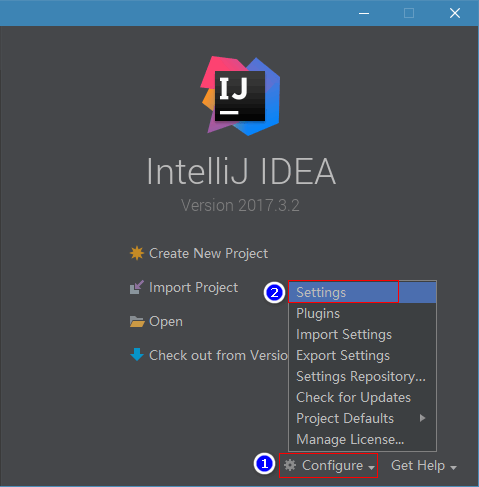
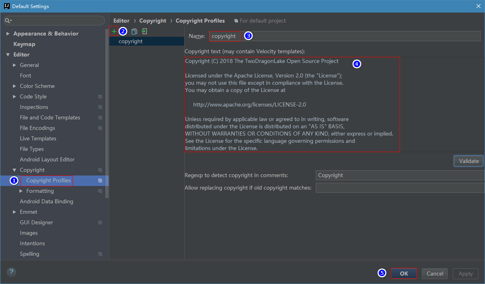
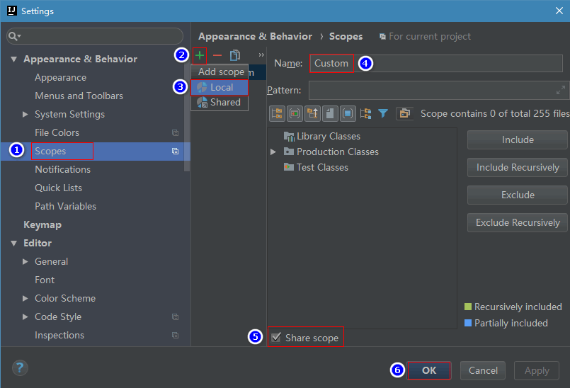
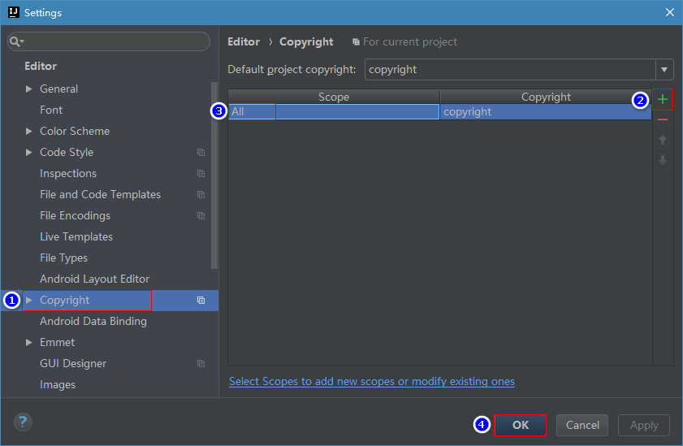
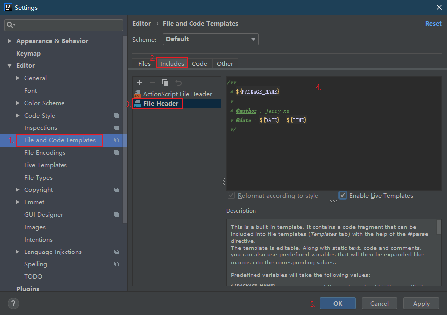

## 统一版权协议
### 环境
* Windows10 操作系统
* IntelliJ IDEA

### IDEA设置
1. 仅对当前项目设置  
     在已打开的项目中进行
2. 全局设置【推荐】  
     方法：在未进入项目时进行设置  
    
### 注释
* 版权注释：  

     ```
     Copyright (C) 2019 The TwoDragonLake Open Source Project

     Licensed under the Apache License, Version 2.0 (the "License");
     you may not use this file except in compliance with the License.
     You may obtain a copy of the License at

          http://www.apache.org/licenses/LICENSE-2.0

     Unless required by applicable law or agreed to in writing, software
     distributed under the License is distributed on an "AS IS" BASIS,
     WITHOUT WARRANTIES OR CONDITIONS OF ANY KIND, either express or implied.
     See the License for the specific language governing permissions and
     limitations under the License.
     ```

1. 查看IDEA中是否已安装`Copyright`插件，没有请自行安装  
2. 创建Copyright模板  
Settings -> Editor -> Copyright -> Copyright Profiles  

3. 增加一个Scopes  
Settings -> Appearance & Behavior -> Scopes  
`add scopes 一定要选择Local类型`  
  
4. 关联Copyright和Scope  
Settings -> 找到Editor -> Copyright   


* 类注释：

     ```java
     /**
     * ${PACKAGE_NAME}
     *
     * @author : Jerry xu
     * @date : ${DATE}  ${TIME}
     */
     ```

1. 添加类注释模板


* 方法注释：  
更多具体字段可见[极客学院Java语言快速入门文档](http://wiki.jikexueyuan.com/project/java/documentation.html)  

## 贡献指南
请在你要提 issue 或者 pull request 之前花几分钟来阅读一遍这篇指南。

### 透明的开发
我们所有的工作都会放在 GitHub 上。不管是核心团队的成员还是外部贡献者的 pull request 都需要经过同样流程的 review。

### 分支管理
每个项目基础的分支结构

* master：项目主干，Realse 版本
* dev：开发分支
* gh-pages：项目Web简要介绍
* features：根据项目进展，切出的分支

!!! tip "注意"
    如果你要修一个 bug，那么请发 pull request 到 master；如果你要提一个增加新功能的 pull request，那么请基于 feature 分支来做。

### Bugs
我们使用 `GitHub Issues` 来做 bug 追踪。 如果你想要你发现的 bug 被快速解决，最好的办法就是通过我们提供的 issue 小助手 来提 issue。并且能使用这个 模板 来提供重现。

在你报告一个 bug 之前，请先确保已经搜索过已有的 issue 和阅读了我们的 常见问题。

### 新增功能
如果你有改进我们的 API 或者新增功能的想法，我们同样推荐你使用我们提供的 issue 小助手 来新建一个添加新功能的 issue。

### 第一次贡献
如果你还不清楚怎么在 GitHub 上提 Pull Request ，可以阅读下面这篇文章来学习

为了能帮助你开始你的第一次尝试，我们用 good first issues 标记了一些比较比较容易修复的 bug 和小功能。这些 issue 可以很好地做为你的首次尝试。

如果你打算开始处理一个 issue，请先检查一下 issue 下面的留言以确保没有别人正在处理这个 issue。如果当前没有人在处理的话你可以留言告知其他人你将会处理这个 issue，以免别人重复劳动。

如果之前有人留言说会处理这个 issue 但是一两个星期都没有动静，那么你也可以接手处理这个 issue，当然还是需要留言告知其他人。

!!! note ""
    [如何优雅地在 GitHub 上贡献代码](https://segmentfault.com/a/1190000000736629).

### Pull Request
TDL 团队会关注所有的 pull request，我们会 review 以及合并你的代码，也有可能要求你做一些修改或者告诉你我们为什么不能接受这样的修改。

在你发送 Pull Request 之前，请确认你是按照下面的步骤来做的：

1. 基于 正确的分支 做修改。

2. 如果你修复了一个 bug 或者新增了一个功能，请确保写了相应的测试，这很重要。